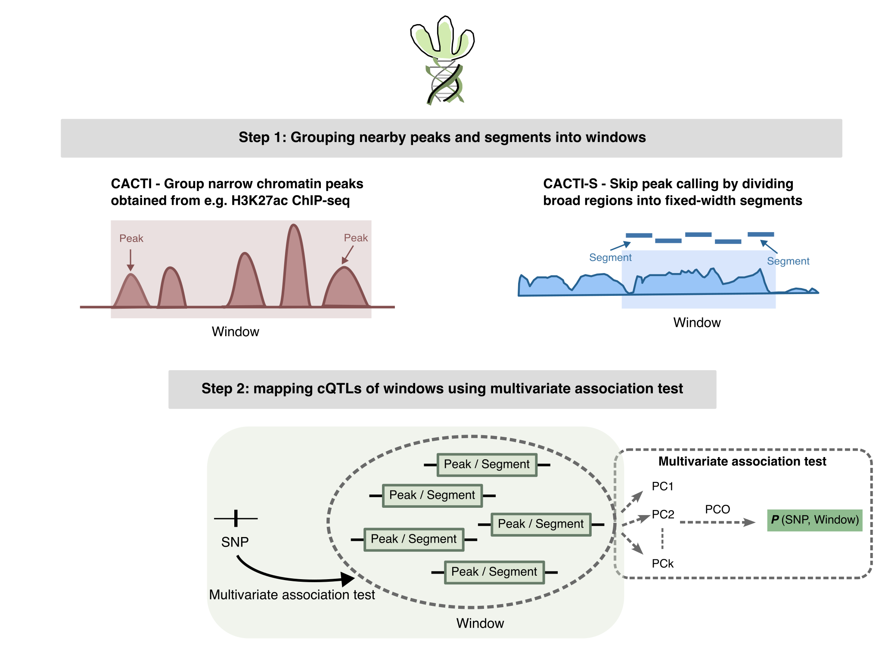

# CACTI: Leveraging Correlated Regulatory Elements for Powerful Chromatin QTL Detection

## Overview



CACTI (**C**hrom**A**tin quantitative lo**C**i of mul**TI**ple peaks)
implements a powerful method for chromatin QTL mapping that leverages the correlation structure of nearby regulatory elements.


The package offers two main modules:
    
1.  **CACTI (Peak-window method):**

* Groups pre-defined peaks into non-overlapping windows of fixed genomic size.
* Residualizes peak intensities with respect to covariates.
* Runs multi-peak association tests using a principal-component omnibus (PCO) test.
* Aggregates results and computes window-level FDR.

2.  **CACTI-S (Sample-based pipeline):**
* An end-to-end preprocessing workflow to go from raw BAM files to normalized phenotype matrices to QTL mapping.
* Performs segmentation, read counting, QC/filtering, and normalization.
* Runs cis-QTL mapping to generate input files for CACTI.


------------------------------------------------------------------------

## Installation

``` r
install.packages("devtools")   # if not installed yet
devtools::install_github("liliw-w/cacti", build_vignettes = TRUE)
```

After installation:

``` r
library(cacti)
```

------------------------------------------------------------------------

## Documentation

### Vignettes

See the [full documentation and vignettes](https://github.com/XuanyaoLiuLab/cacti) for -

- CACTI Peak-Window Pipeline

- CACTI-S Pipeline

Vignettes can also be viewed within the installed package -

```r
vignette("cacti_peak_window", package = "cacti")
vignette("cacti_s_prep", package = "cacti")
```


### Main functions documentation

```r
?cacti_run_chr
?cacti_run_genome
?cacti_add_fdr
?cacti_s_prep
```

------------------------------------------------------------------------


## Citation

If you use the CACTI method, please cite:

> Wang, L., & Liu, X. (2025). Improved chromatin QTL mapping with CACTI.
> bioRxiv, 2025-06.
