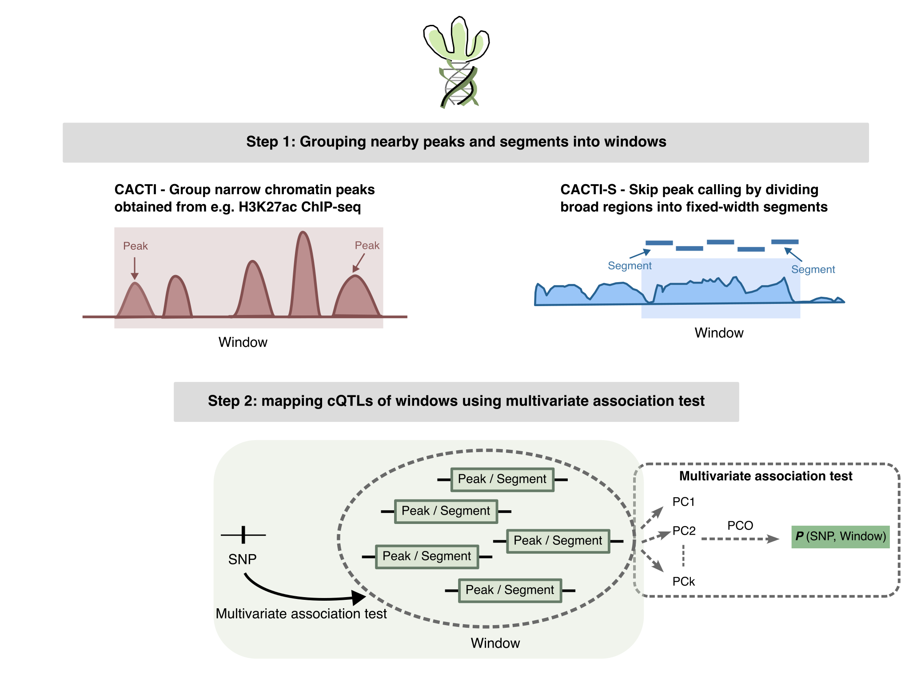

# CACTI: Leveraging Correlated Regulatory Elements for Powerful Chromatin QTL Detection

## Overview



CACTI
implements a powerful method for chromatin QTL mapping that leverages the correlation structure of nearby regulatory elements.


The package offers two main modules:
    
1.  **CACTI (Peak-based method):**
* Suitable for chromatin features with narrow peak signatures (H3k27ac, H3k4me1, ATAC-seq, etc)
* Peak calling should be performed before applying CACTI.
* Takes the same input as standard QTL calling tools: genotype, phenotype (called peaks) and covariates

2.  **CACTI-S (Segment-based pipeline):**
* Suitable for chromatin features with broad peak signatures (H3K27me3, H3K36me3, etc)
* Skips peak calling, an end-to-end preprocessing workflow to go from raw BAM files to normalized phenotype matrices to QTL mapping.
* Performs segmentation, read counting, QC/filtering, and normalization.
  

------------------------------------------------------------------------

## Installation

### Prerequisites

Before installing CACTI, ensure you have:

- **R >= 4.0.0** - Check your version with `R.version.string`
- **Pandoc** - Required for building vignettes. See [pandoc github](https://github.com/cderv/pandoc) for detailed instruction. 
- **ACAT** - Required for association testing. See [ACAT github](https://github.com/yaowuliu/ACAT) for detailed instruction.
- **qvalue** - Required for FDR correction. See [qvalue github](https://github.com/StoreyLab/qvalue) for detailed instruction.
- **Rsubread** - Required for read counting in CACTI-S. See [Rsubread website](https://www.bioconductor.org/packages//2.10/bioc/html/Rsubread.html) for detailed instruction.


``` r
install.packages("devtools")   # if not installed yet
devtools::install_github("XuanyaoLiuLab/cacti", build_vignettes = TRUE)
```

After installation:

``` r
library(cacti)
```

------------------------------------------------------------------------

## Documentation

### Vignettes

See the [full documentation and vignettes](https://xuanyaoliulab.github.io/cacti/) for -

- CACTI Peak-Window Pipeline

- CACTI-S Pipeline

Vignettes can also be viewed within the installed package -

```r
vignette("cacti_peak_window", package = "cacti")
vignette("cacti_s_prep", package = "cacti")
```


### Main functions documentation

```r
?cacti_run_chr
?cacti_run_genome
?cacti_add_fdr
?cacti_s_prep
```

------------------------------------------------------------------------


## Citation

If you use the CACTI method, please cite:

> Wang, L., & Liu, X. (2025). Improved chromatin QTL mapping with CACTI.
> bioRxiv, 2025-06.
