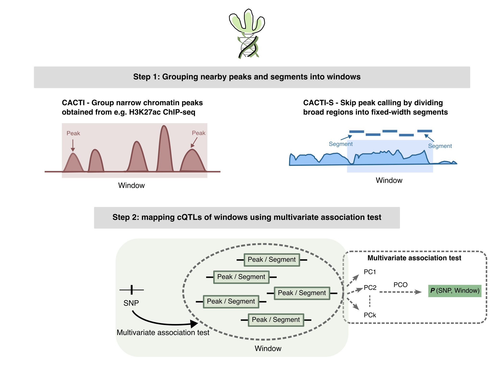

# CACTI: Leveraging Correlated Regulatory Elements for Powerful Chromatin QTL Detection

## Overview



CACTI
implements a powerful method for chromatin QTL mapping that leverages the correlation structure of nearby regulatory elements.


The package offers two main modules:
    
1.  **CACTI (Peak-based pipeline):**
* Suitable for chromatin features with narrow peak signatures (H3k27ac, H3k4me1, ATAC-seq, etc)
* Peak calling should be performed before applying CACTI.
* Takes standard input in standard QTL calling tools: genotype, phenotype (called peaks) and covariates
* A summary statistics-based option is available too

2.  **CACTI-S (Segment-based pipeline):**
* Suitable for chromatin features with broad peak signatures (H3K27me3, H3K36me3, etc)
* Skips peak calling, an end-to-end preprocessing workflow to go from raw BAM files to normalized phenotype matrices to QTL mapping.
* Performs segmentation, read counting, QC/filtering, and normalization.
  

------------------------------------------------------------------------

## Installation

Use a current R release. CACTI requires R >= 4.1.0; its dependencies may require newer R. Check your version with `R.version.string`.

```r
if (!requireNamespace("remotes", quietly = TRUE)) {
  install.packages("remotes", repos = "https://cloud.r-project.org")
}
if (!requireNamespace("BiocManager", quietly = TRUE)) {
  install.packages("BiocManager", repos = "https://cloud.r-project.org")
}
options(repos = BiocManager::repositories())
remotes::install_github("XuanyaoLiuLab/cacti", build_vignettes = FALSE)
```

Required CRAN and Bioconductor packages are installed automatically.

After installation:

``` r
library(cacti)
```

------------------------------------------------------------------------

## Getting Started in 5 Minutes

### 1) Run CACTI peak-window (genome-wide default)

```r
library(cacti)

file_pheno_meta <- system.file("extdata", "test_cacti_peak_chr5_pheno_meta.bed", package = "cacti")
file_pheno <- system.file("extdata", "test_cacti_peak_chr5_pheno.txt", package = "cacti")
file_cov <- system.file("extdata", "test_cacti_peak_chr5_covariates.txt", package = "cacti")
file_vcf <- system.file("extdata", "test_cacti_peak_chr5_geno.vcf", package = "cacti")
qtl_file <- system.file("extdata", "test_cacti_peak_chr5_matrixqtl_sumstats.txt.gz", package = "cacti")

res <- cacti_peak_window(
  window_size = "50kb", # window size to group peaks
  file_pheno_meta = file_pheno_meta,
  file_pheno = file_pheno,
  file_cov = file_cov,
  file_vcf = file_vcf,
  chr = "All",      # default: run all chromosomes in file_pheno_meta
  do_fdr = TRUE,    # default: add FDR correction
  out_prefix = tempfile("cacti_quickstart_")
)

res$file_fdr_out

# Optional summary-stats mode
res_qtl <- cacti_peak_window(
  window_size = "50kb",
  file_pheno_meta = file_pheno_meta,
  file_pheno = file_pheno,
  file_cov = file_cov,
  qtl_file = qtl_file,
  chr = "chr5",
  do_fdr = TRUE,
  out_prefix = tempfile("cacti_quickstart_qtl_")
)

res_qtl$file_fdr_out
```

### 2) Run CACTI-S prep (raw BAM to cis-QTL summary stats)

```r
library(cacti)

file_bams <- c(
  system.file("extdata", "Sample1.bam", package = "cacti"),
  system.file("extdata", "Sample2.bam", package = "cacti"),
  system.file("extdata", "Sample3.bam", package = "cacti"),
  system.file("extdata", "Sample4.bam", package = "cacti")
)
file_vcf <- system.file("extdata", "test_geno.vcf", package = "cacti")
file_cov <- system.file("extdata", "test_cov.txt", package = "cacti")

res_s <- cacti_s_prep(
  file_bams = file_bams,
  file_vcf = file_vcf,
  file_cov = file_cov,
  out_dir = tempdir(),
  out_prefix = "cacti_s_quickstart"
)

res_s
```

Notes:

- Input conventions are standard QTL inputs: genotype, phenotype, and covariates with matched sample IDs.
- `cacti_peak_window()` also supports summary-statistics mode via `qtl_file`/`qtl_files`.

The bundled synthetic data demonstrate the workflows; they do not evaluate statistical power, calibration, or biological validity.

------------------------------------------------------------------------

## Optional input-data QC

Three independent functions report diagnostics and warnings without modifying the inputs. They are not run automatically by the CACTI or CACTI-S workflows.

| Function | Input format | Diagnostics |
|:--|:--|:--|
| `cacti_qc_samples()` | Numeric feature-by-sample matrix; specify `input_type = "raw_counts"` or `"normalized"`. | Missing/non-finite values; for raw counts, total counts for the sample and proportion of zero measurements. |
| `cacti_qc_features()` | Numeric feature-by-sample matrix; specify the input type. | Missing/non-finite values and variance; for raw counts, mean counts, detection frequency, and proportion of zero measurements. |
| `cacti_qc_library()` | Named character vector of BAM paths, with sample/library IDs as names. No BAM index is required. | Read depth, mapping quality, usable reads, duplicate flags, mean base quality, and proportion of bases with Q >= 30. |

For both matrix functions, samples are columns, with sample IDs as column names; features are rows, with feature IDs as row names. Supply numeric R matrices or numeric data frames, not file paths. Both functions return the number of samples (`n_samples`), the number of features (`n_features`), a descriptive `summary` table, and `warnings`. Count totals, zero proportions, detection proportions, and variance use the observed finite measurements; missing and non-finite values are reported separately. Metrics requiring observations are `NA` when none are available. Count totals sum over the supplied features, not all sequenced reads; count-based diagnostics do not apply to normalized phenotypes.

```r
phenotype <- as.matrix(read.delim(
  system.file("extdata", "test_cacti_peak_chr5_pheno.txt", package = "cacti"),
  row.names = 1, check.names = FALSE
))
sample_qc <- cacti_qc_samples(phenotype, input_type = "normalized")
feature_qc <- cacti_qc_features(phenotype, input_type = "normalized")
c(n_samples = sample_qc$n_samples, n_features = feature_qc$n_features)
sample_qc$summary
head(feature_qc$summary)

bam_qc <- cacti_qc_library(
  setNames(file_bams, sub("\\.bam$", "", basename(file_bams)))
)
bam_qc$summary
```

BAM metrics count primary read records, not paired-end fragments, and describe only the records present in the supplied files. Removed reads cannot be recovered. Base quality describes confidence in nucleotide calls, whereas MAPQ describes alignment confidence. `mean_base_quality` is the mean Phred score across bases with stored quality scores; `prop_bases_q30` is the proportion of these bases with Q >= 30. These metrics use all primary records, independently of the usable-read filters. The report also includes `bases_with_quality` and `reads_without_base_quality`; missing qualities are excluded, not treated as zero, and both quality metrics are `NA` when no scores are available.

Set `duplicate_flags = "marked"` only when duplicate marking is known to have been performed; otherwise the duplicate proportion is reported as unavailable. QC warning criteria are configurable, and these diagnostics do not establish statistical power or false-positive control. See the vignettes and function help for examples and metric definitions.

------------------------------------------------------------------------

## Documentation

### Vignettes

See the [full documentation and vignettes](https://xuanyaoliulab.github.io/cacti/) for -

- CACTI Peak-Window Pipeline

- CACTI-S Pipeline

The installation above skips vignette building; use the online documentation. To also install local vignettes, first install [Pandoc](https://pandoc.org/installing.html), then run:

```r
options(repos = BiocManager::repositories())
remotes::install_github(
  "XuanyaoLiuLab/cacti",
  dependencies = TRUE,
  build_vignettes = TRUE,
  force = TRUE
)
```

After installation with vignettes:

```r
vignette("cacti_peak_window", package = "cacti")
vignette("cacti_s_prep", package = "cacti")
```


### Main functions documentation

```r
?cacti_run_chr
?cacti_run_genome
?cacti_add_fdr
?cacti_s_prep
```

------------------------------------------------------------------------


## Citation
The CACTI method was developed by Lili Wang https://x.com/liliw_wang. 

If you use the CACTI method, please cite:

> Wang, L., & Liu, X. (2025). Improved chromatin QTL mapping with CACTI.
> bioRxiv, 2025-06.
